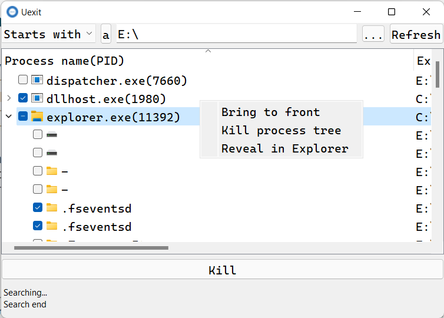

# Uexit

When I disconnect a USB drive, I get the warning as "This device is currently in use. Close any programs or windows that might be using the device, and then try again". This warning drives me crazy. This program aims to find all open file handles with a specific pattern.

When it finds processes open files, Uexit can kill process or close file handle.

## Build

1. create a new python env: python >= 3.7
2. install the required packages `pip install -r requirements.txt`
3. run `src/main.py` to debug(make sure  set `global_seting.set_path(True)` in `src/main.py`), or run `src/build.py` to build binary which will locate at `dist/Uexit.exe`(to build correctly need change `global_seting.set_path(True)` to `global_seting.set_path(False)`, which will set up resource files right)

## Contributing

If you find bugs or some features wanted just make an issue. I will respond as soon as possible.

## Related projects

- [OpenedFilesView](https://www.nirsoft.net/utils/opened_files_view.html) I think this is better than Uexit
- [USB Safely Remove](https://safelyremove.com/index.htm) better GUI and response fast, better than Uexit too
- [LockHunter](https://lockhunter.com/) better than Uexit too. (●'◡'●)

## TODO

- [x] file widget
- [ ] build-in search
- [x] close handle
- [x] file icon
- [x] improve file icon
- [x] kill process tree
- [x] select search type
- [x] case sensitive
- [x] after kill fast refresh(status bar)
- [x] file path enter finish input
- [x] font issue
